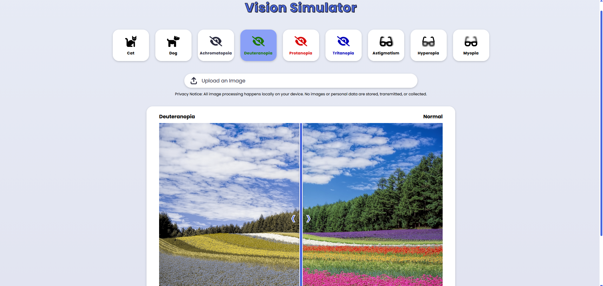

  
# Vision Simulator

<i>A vision simulator that recreates how humans and animals perceive the world through various visual conditions and color deficiencies.</i>

<kbd>  </kbd>

 

 

## Table of Contents
- [Features](#features)
- [How to Use](#how-to-use)
- [Mockups](#mockups)
- [Performance Score](#pagespeed-insights-performance-score)
- [Contributing](#contributing)
- [License](#license)

 

## Features

- **Animal Vision Simulation**: Experience how cats and dogs perceive colors and light intensity.
- **Color Vision Deficiencies**: Explore color blindness types including Deuteranopia, Protanopia, Tritanopia, and Achromatopsia.
- **Eye Condition Simulation**: Visualize effects of Myopia, Hyperopia, and Astigmatism.
- **Live Image Comparison**: Use a slider to compare normal vision with simulated vision in real-time.
- **Local Image Upload**: Upload your own image (JPG/PNG) to test the filters — all processing happens locally.
- **Privacy First**: No data or images are stored or transmitted.

 

## How to Use

1. **Upload an Image**: Click on “Upload an Image” and select a JPG or PNG file from your device.
2. **Choose a Vision Type**: Select from available vision modes such as *Cat*, *Dog*, *Protanopia*, *Myopia*, etc.
3. **Compare Views**: Drag the slider left or right to visually compare normal vision with the simulated one.
4. **Switch Filters Instantly**: Click any other mode button to immediately view its effect.
5. **Observe Differences**: Notice color shifts, blur levels, and brightness variations unique to each vision condition.

 

## Mockups
| [Desktop](https://design.penpot.app/#/view?file-id=ad92598f-af3a-817e-8006-48b5313729de&page-id=ad92598f-af3a-817e-8006-48b5313729df&section=interactions&index=1&interactions-mode=hide&share-id=02df3600-b175-80af-8007-0ec83b87fe18) | [Mobile](https://design.penpot.app/#/view?file-id=ad92598f-af3a-817e-8006-48b5313729de&page-id=ad92598f-af3a-817e-8006-48b5313729df&section=interactions&index=0&interactions-mode=hide&share-id=02df3600-b175-80af-8007-0ec83b87fe18) |
|-------|-------|
| <kbd>  </kbd> | <kbd>  </kbd> |

 

## PageSpeed Insights Performance Score

  
| [Desktop](https://pagespeed.web.dev/analysis/https-eduardasrbastos-github-io-vision-simulator/h95zkagrsj?form_factor=desktop) | [Mobile](https://pagespeed.web.dev/analysis/https-eduardasrbastos-github-io-vision-simulator/h95zkagrsj?form_factor=mobile) |
|-------|-------|
| <kbd>  </kbd> | <kbd>  </kbd> |

## Contributing
- Support this project by giving it a star ⭐. Thanks!
- Feel free to suggest improvements or report any issues in the repository.

## License
This project is licensed under the MIT License - see the [LICENSE](LICENSE) file for details.
